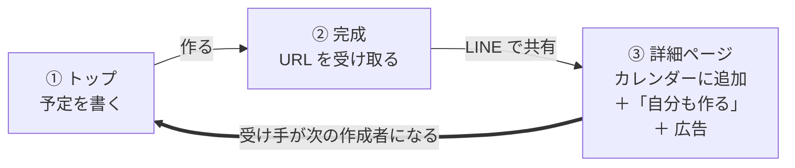
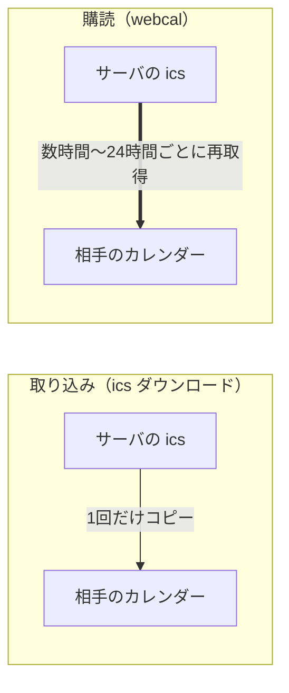

# 予定をURLに — コンセプトと体験設計

> 状態: 詳細設計 ready / 更新: 2026-09-16 / 未決: 6件

図つきの読みやすい版: https://claude.ai/artifact/Q34e3ciXEjxGLFf1jG3yr1

---

## 01. コンセプト

> 予定を書くと、URLになる。
> 渡された人は、ボタンひとつで自分のカレンダーに入れられる。

ログイン不要、5秒、無料。似たものとして「Add to Calendar リンク生成」ツールは既に数多くあるが、それらはどれも出力（Google カレンダーのリンクと ics）で勝負している。出力は1日で作れるコモディティなので、このプロダクトの価値は入力の摩擦をゼロにすることに置く。

### 3つの原則

1. **入力欄は常に1つ** — 1行でも、100行でも、将来的には PDF でも、同じ場所に入れる。貼るものの重さが、そのままプロダクトの深さになる。
2. **ユーザーに設定を選ばせない** — 保存期間も、タイトルも、公開範囲も、黙って正解を出す。選択肢を1つ足すたびにライトユーザーが減る。
3. **詳細ページの仕事は、次の作成者を作ること** — 認知はユーザーが貼った URL を通じてしか広がらない。転換導線は、広告よりもカレンダー追加よりも上位に置く。

### 合格基準

作成動線の設計判断は、すべてこの一文で決める。

> LINE に「9/20 19時 渋谷」と直接打つより速いこと。

### ポジション

調整さんは「決める前」、これは「決まった後」。日程調整ツールの後工程にあたる空白地帯を取る。ただし調整さん自身がここを強化してくる可能性は常にあるので、差別化は入力側に置き続ける。

---

## 02. スコープ

- **Phase 1** = 最初のリリース
- **Phase 2** = 数字を見てから
- **Phase 3** = 事業者向け有料機能
- **持たない** = 意図的に作らない

Phase 1・2 は非課金で走る。決済も特定商取引法の表記もサポート窓口も持たない。収益化は Phase 3 で、個人ではなく事業者から取る（§09）。

| 機能 | 判断 | 理由 |
|---|---|---|
| 単発イベントの作成（1行テキスト） | Phase 1 | これ単体でプロダクトとして成立する。入口はここ |
| ルールベースの日時パース | Phase 1 | 入口そのものなので、無料の必須機能とする |
| Google カレンダー追加リンク ＋ ics | Phase 1 | 単発なら1クリックで完結する |
| プリフィル付き作成 URL | Phase 1 | テンプレページ・外部連携・複製がこれ1本で実装できる |
| OGP 画像の自動生成 | Phase 1 | LINE に貼られた時点で日時が読める。認知獲得の主経路 |
| 「自分も作る」転換導線 | Phase 1 | 成長の主要因なので、KPI の最上位に置く |
| 作成履歴（localStorage） | Phase 1 | ログインなしで再訪の理由を作る |
| 複数イベント（貼り付け・PDF・画像） | Phase 2 | 入力欄が同じなので後から足せる。年間行事・シフト・しおり向け |
| webcal 購読 | Phase 2 | 単発イベントに購読は要らない。複数イベントとセットで、無料で出す |
| ユースケース別テンプレページ | Phase 2 | プリフィルの応用。検索流入の入口を増やす |
| Google ログイン | Phase 2 | 端末をまたぐ必要が出てから |
| パスワードロック | Phase 3 | 事業者の実需があり実装は軽い。無料で出すとモデレーションの死角になるので、課金が身元確認を兼ねる |
| 広告非表示・発行者ロゴ表示 | Phase 3 | 同上。匿名の誰かに渡すと悪用される機能は、課金の壁が防御を兼ねる |
| 無期限の保持 | Phase 3 | 13ヶ月上限の解除。継続的にスケジュールを配信する事業者向け |
| 出欠・コメント | 持たない | 調整さんの領域。入れると別のプロダクトになる |
| 予約・受付機能 | 持たない | Airリザーブ等の領域。「配信はする、受付はしない」を最初に決めておく |
| アカウント必須化 | 持たない | ログイン不要が最大の武器 |
| 公開範囲・保存期間の設定 | 持たない | 原則 2 に反する。すべて自動で決める |
| 匿名認証（Firebase / Supabase） | 持たない | 編集トークンで代替できる（§08） |

---

## 03. 画面構成

画面は4枚。①②は作成者だけが見て、③は共有された全員が見る。トラフィックの大半は③に来るので、設計の重心もそこに置く。

### ① トップ ＝ 作成

```
┌─────────────────────────────┐
│  予定を書いてください            │
│ ┌─────────────────────────┐ │
│ │ 9/20 19時 渋谷で飲み会      │ │
│ └─────────────────────────┘ │
│                               │
│  こう解釈しました               │
│  │ タイトル  飲み会            │
│  │ 日時     9月20日(日) 19:00〜 │
│  │ 場所     渋谷               │
│  タップして直せます             │
│                               │
│      [  URLを作る  ]          │
└─────────────────────────────┘
```

トップページそのものが入力欄で、説明文は入力欄の下に置く。入力に応じて解釈結果をリアルタイムでプレビューし、パースが外れたらプレビューの各項目をその場でタップして直す。

項目が縦に並んだ入力フォームは出さない。フォームを見た瞬間にライトユーザーは帰るので、フォームが現れるのは編集時だけにする。

### ② 完成

```
┌─────────────────────────────┐
│  できました                    │
│  xxx.jp/a7Kq2                 │
│      [ コピー ]                │
│  [ LINEで送る ]  [ 共有 ]      │
│  ─────────────────────        │
│  自分のカレンダーにも入れる →    │
│  9/27 まで表示されます          │
│  あとから編集できます            │
│  ───────── 広告 ─────────      │
└─────────────────────────────┘
```

URL とコピーボタンが主役で、OS の共有シートを呼ぶ。作成者自身も予定を入れたいので「自分のカレンダーにも入れる」を併置する。広告を置くならここで、用が済んだ後なので邪魔にならない。

### ③ 詳細ページ

```
┌─────────────────────────────┐
│  飲み会                        │
│  9月20日(日) 19:00〜           │
│  渋谷                          │
│                               │
│ [Googleカレンダー] [その他(ics)]│
│                               │
│  地図で見る ↗                  │
│  会費5000円、遅れる人は連絡      │
│ ═══════════════════════       │
│  あなたも予定URLを作れます       │
│      [  作ってみる  ]          │  ← 成長エンジン
│ ═══════════════════════       │
│  ───────── 広告 ─────────      │
│  このページは 9/27 まで表示       │
└─────────────────────────────┘
```

日時と場所は、スクリーンショットして LINE に貼れる見やすさで組む。実際にそうされる。カレンダー追加ボタンは2個（Google カレンダー／その他 = ics）で、単発イベントならこれで完結する。

「自分も作る」導線は広告より上に置く。ページ下部には期限を明示する。

OGP 画像は自動生成したい。LINE に貼られたときカードに日時と場所が描かれていれば、リンクを踏まなくても価値が伝わり、同時にサービス名が露出する。開封されない URL からも認知が取れるのは、この設計ならではの利点になる。

### ④ 履歴（おまけ）

ヘッダに小さく「作ったURL」を置き、localStorage から復元する。端末が変わったら消えるが、そこで初めて「ログインしますか」が自然に出せる。

---

## 04. 画面遷移とグロースループ



広告収入もカレンダー連携も、③ から ① に戻る矢印が回って初めて意味を持つ。ここが細いまま他を磨いても数字は伸びない。OGP 画像により、リンクが開かれなくても露出は発生する。

---

## 05. 作成動線の仕様

### 日時パースは2段構え

「自然言語パース＝ LLM」ではない。1行の日時抽出は正規表現と日付ライブラリで 8 割以上当たる。日本語の日時表現は意外と定型で、拾うべきパターンはこのあたりに収まる。

```
M/D   M月D日   (土)   HH:MM   HH時   午後X時   〜   から
明日   あさって   来週◯曜
```

日時として消費されなかった残りの文字列から、場所とタイトルを拾う。まずルールベースで処理し、外れたときだけ LLM に回すフォールバック構成にすれば、LLM の呼び出し回数を大きく減らせる。

### プリフィル：パラメータごとに初期値を渡せる

作成画面は、クエリパラメータで各項目に初期値を受け取れるようにする。パラメータ名と形式は Google カレンダーの `render?action=TEMPLATE` に揃える。独自の名前を発明する理由がなく、既存の Add to Calendar リンク生成ツールの出力をそのまま流し込めるため。

| パラメータ | 内容 | 例 |
|---|---|---|
| `text` | タイトル | `飲み会` |
| `dates` | 開始/終了（ISO basic, UTC） | `20260920T100000Z/20260920T130000Z` |
| `location` | 場所 | `渋谷` |
| `details` | メモ | `会費5000円` |
| `q` | 自然文（構造化パラメータが無いときだけ使う） | `9/20 19時 渋谷で飲み会` |

機械が組み立てるなら構造化パラメータ、人間が貼るなら自然文。両方が来たら構造化パラメータを優先する。呼び出し側が結果を保証できるかどうかで順位を決めている。

これ1本で、次のものが追加実装ほぼゼロで実現する。

- ユースケース別テンプレページ（`/t/シフト表` は実質プリフィル済みの `/new`）
- 他サービス・ブログ・Notion からの流入導線
- ブックマークレット、モバイルの共有シート
- 詳細ページの「これをコピーして作る」

> **注意: プリフィルは即公開しない**
> プリフィル URL を踏んだだけで公開されると、ワンクリック公開のスパム踏み台になる。必ず作成画面で止め、ユーザーが「作る」を押して初めて発行する。

---

## 06. カレンダー連携

### 取り込みと購読は別物



取り込みは以後サーバと無関係になる。変更は届かないが、ページが消えても手元に残る。購読はサーバが ics を配信し続ける義務を負うため、購読者がいる URL は GC できない。

webcal の実体は、ics を配信している https URL のスキームを差し替えただけ。OS に「ダウンロードではなく購読だ」と伝えるシグナルで、標準仕様ではなく Apple 由来の慣習がデファクトになったもの。

| | 取り込み（import） | 購読（webcal） |
|---|---|---|
| 実体 | 1回読んでイベントをコピー | サーバの ics が正 |
| 変更の反映 | されない | される |
| ページが消えたとき | 手元に残る | カレンダーからも消える |
| 相手側の編集 | 自分のイベントなので自由 | 基本は読み取り専用 |
| 更新間隔 | — | Google は制御不可（数時間〜24h）／Apple はユーザーが選べる |
| サーバの義務 | 配信後は用済み | 購読され続ける限り配信し続ける |

### 購読者は数えない

webcal には登録通知やハンドシェイクが一切なく、クライアントが定期的に ics URL を GET してくるだけなので、購読者数は原理的に測れない。Google はサーバサイドで取得して配信するためリクエストが集約され、Apple は端末ごとに来る。プラットフォームごとに「リクエスト数と購読者数の関係」が違うので、比較可能な数字にならない。購読解除も、単にアクセスが来なくなるだけで検知できない。

そこで、購読者の生存を確認しようとするのをやめる。保持期限は「最終イベント終了 +7日」だけで決め、購読者がいてもいなくても同じ扱いにする（§07）。未来のイベントがある限りページは生き、なくなったら消える。UA 判定もヒューリスティックも要らない。

ページが消えると購読も死ぬが、取り込み済みの相手のカレンダーには残るため実害は小さい。詳細ページが見られなくなるだけで済む。

### プラットフォーム別の挙動

| 環境 | ics 取り込み | webcal 購読 | 備考 |
|---|---|---|---|
| iOS Safari | 良好 | 良好 | タップで「照会するカレンダー」が出る |
| macOS | 良好 | 良好 | — |
| Google カレンダー Web (PC) | 可 | 可 | 設定から URL 追加。手数が多い |
| Google カレンダー モバイルアプリ | 難 | 不可 | 購読 URL を追加する UI が存在しない |
| Android Chrome | 難 | 不可 | ics が単に DL され、手動で開く必要がある |
| LINE 内蔵ブラウザ | 難 | 不可 | 日本市場では利用者が多い |

### 設計への影響

Phase 1 の単発イベントは購読を必要としない。日時が確定していて変わらないなら取り込みで足りるので、webcal は Phase 2 に回す。

Phase 2 で複数イベントを扱うときは、Google カレンダーの追加リンクが1イベント1リンクである制約により「ボタン2個で完結」が崩れる。イベントごとに「＋」を並べるか、ics 一括取り込みにするかの分岐が発生する（§10）。

Android 向けに Google Calendar API での一括書き込みを考える場合、`calendar.events` は sensitive/restricted scope で審査が必須になり、個人開発には重い。ics 取り込みか Web Push で凌ぐほうが現実的だろう。

そもそも「カレンダーに入れる」は手段で、目的は忘れないことにある。前日に Web Push が飛べばニーズの大半は満たせるかもしれず、通知はそのまま再訪＝ PV になるので広告モデルとも噛み合う。Android 対策の第一候補として検討の価値がある。

---

## 07. 保持期間と上限

当初案の「作成から7日」は採らない。来月の飲み会の URL を今日共有すると、イベント前にリンクが死ぬため。かといってユーザーに期間を選ばせると原則 2 に反する。かわりに、次の2行で決め打つ。

- 保持期限は「最終イベント終了 + 7日」
- 作成できるのは13ヶ月先まで

この2行で、保持に関する判断がすべて閉じる。ユーザーは何も決めなくてよく、こちらも購読者の生存確認のような不確実な仕組みを持たずに済む。

```
① いま
  今日                                              13ヶ月
   |----●--------●-------●---┆------------------------|
        予定A     予定B    予定C ┆                     作成できる上限
                              削除 (C +7日)

② あとから予定Dを足すと
  今日                                              13ヶ月
   |----●--------●-------●---------●---┆-------------|
        予定A     予定B    予定C      予定D ┆        ここは動かない
                                         削除 (D +7日)

                      期限が自動で後ろに伸びる →
```

未来のイベントがある限りページは生き、なくなったら消える。事業者が毎月レッスン日を足していけば購読は生き続け、更新が止まれば自然に終わる。購読者が何人いるかを知らなくても成立する。

| 項目 | ルール |
|---|---|
| 保持期限 | 最終イベント終了 + 7日。イベントを足すと自動で伸びる |
| 日時が取れない下書き | 作成 + 7日 |
| 作成できるイベントの上限 | 13ヶ月先まで（年度をまたぐ年間行事が収まる長さ） |
| 最大保持期間 | 約 13ヶ月 + 7日 |
| webcal 購読 | ページの保持期限と同じ。購読者数は数えない（§06） |
| 無期限の保持 | Phase 3。事業者向けに上限解除を後付けできる形にしておく |
| URL | 推測不能なランダム文字列、`noindex` |
| タイトル | 入力から自動。無ければ日時をそのまま |
| 編集権限 | 作成時に発行した編集トークンを localStorage に保存 |

### 13ヶ月上限を置く理由

課金の壁としてではなく、仕様上の制約として置く。遠い未来の日付で長期居座りページを作る攻撃を封じられること、そして最大保持期間が確定して同時保持件数の上界が読めることの2点による。

13ヶ月より先の予定を入れたい人には「13ヶ月以内に分けて作る」で対応できる。実際に上限で弾かれるのは極端なケースだけなので、無料枠を段階化する必要はない。

保持期間が短いことには副次的な効能もある。匿名投稿に混ざる個人情報を長期保持しなくて済み、スパムのランディングページとして居座られることもない。後者は §09 の防御の一部として効く。

---

## 08. 認証・ユーザー管理

### フェーズ0：認証なしで成立する

作成時にサーバが編集トークン（ランダム文字列）を発行して localStorage に保存し、履歴も localStorage に持つ。実装コストはほぼゼロで、ログイン不要の原則も守れる。欠点は端末を変えると消えることだけ。

### 匿名認証は入れない

相性が良さそうに見えるが、編集トークンがすでに匿名認証の役割を果たしている。匿名認証の本来の価値は「サーバ側にユーザー単位のデータを持ちたい」ときで、このプロダクトは localStorage で足りる。加えて匿名ユーザーは無限に作れるので、レート制限の単位としても使えない。

Google ログインを足すときも、匿名認証を経由する必要はない。localStorage の編集トークンを一括でサーバに送って新規アカウントに紐付ける移行を1回書けば、同じ体験になる。むしろそのほうが簡単。

### SaaS の選定

詳細ページを開く人は大量にいる一方、ログインするのはごく一部という特性がある。したがって MAU 課金のサービスは、成長したときに一番効いてくる。

| 選択肢 | 手間 | 判断 |
|---|---|---|
| 自作（OIDC 直叩き） | Google だけなら 150 行程度 | セッション管理・CSRF を自分で正しくやる覚悟があるなら可 |
| Auth.js (NextAuth) | 数十行 | ◎ 無難な落とし所 |
| Supabase Auth | ほぼゼロ | ◎ Supabase を DB に使うなら。RLS と統合されて楽 |
| Firebase Auth | ほぼゼロ | ○ Firestore を使うなら |
| Clerk / Auth0 | ゼロ | △ MAU 課金。無料枠超過時の単価が高い |

認証単体で選ばず、DB と同じベンダーに揃える。自前 Postgres（Neon / D1 など）なら Auth.js + Google のみ。「Google ログインだけ」なら自作も現実的だが、セッション・CSRF・トークン更新の実装ミスは事故に直結する一方 Auth.js を挟むコストはほぼゼロなので、そちらを推す。

Google OAuth の審査については、`email` / `profile` だけなら sensitive scope ではないので不要ですぐ使える。未確認アプリの警告を消してロゴを出すには verification が要るが、これは軽い。重いのは §06 で触れた `calendar.events` のほう。

---

## 09. コスト・収益・防御

### 個人からは取らない。事業者から取る

「課金するかどうか」を一枚で考えると詰まるが、誰から取るかで分けると経済がまったく別物になる。個人が月300円を高いと感じる一方、事業者にとって月1,500円は自社サイトを1つ持つより安い。

| | 個人（C） | 事業者（B） |
|---|---|---|
| 払う気 | 月300円でも高く感じる | 月1,500円は「安い」 |
| 比較対象 | 無料ツール | ホームページ運営（Wix・ペライチで月1,500〜2,000円＋ドメイン） |
| 転換率 | 0.5%程度 | 動機が明確なので桁違いに高い |
| 継続 | 用が済んだら離脱 | 教室・公演・クラスが続く限り継続 |
| 役割 | パーセプションを作る | 収益を作る |

対象になるのは、スケジュールが定期的に発生して、それを客に伝えたい事業者——ヨガ教室、ピアノ教室、学習塾、ジム、ライブハウス、劇団、地域イベント。今は自前サイトか SNS に手で書いている層で、月1,500円 × 100事業者で月15万円になる。個人開発の変動費を賄うには十分すぎる。

営業は要らない。C 側で広まった結果その中に事業者が混ざり、継続的に使いたくなって課金する。プロダクト経由で B に到達する構造が最初からできている。調整さんに法人プランがあるのと同じ形。

### Phase 1・2 は非課金

C 側で数字が立っていない段階で B 向け機能を作っても売れない。そして初期スケールでは課金が割に合わない。月100ページ作成・転換率0.5%・¥300 なら月¥150で、この額のために決済実装・特定商取引法の表記（個人だと住所の公開が必要）・返金対応・問い合わせ窓口を背負うことになる。

幸い Phase 1 は変動費がほぼゼロで、回収の必要がない。1行パースはルールベース、配信は静的、ストレージは1ページ数KB。無料枠のまま放置できる。

ただし固定費として Cloudflare Workers Paid（月$5）だけは契約する。OGP 画像生成の CPU 時間が Workers Free の上限（1リクエスト10ms）を超えるため（design.md §1.2）。

### 変動費は広告で賄える

Phase 2 で LLM（PDF・画像変換）を出すと、初めて線形に増える費用が発生する。ここはリワード広告では賄えない。Web ではリワードの在庫が薄く、そもそも「1人が1回見る」なので配布人数に比例しないため。

だが通常のディスプレイ広告はファンアウト比に比例するので、絵が変わる。

| 用途 | 変換コスト | ページの生涯PV | 広告収入（CPM ¥200 換算） |
|---|---|---|---|
| 年間行事（30世帯に配布） | 約 ¥1 | 控えめに 30PV | 約 ¥6 |
| シフト表 | 約 ¥1 | 10PV | 約 ¥2 |
| 単発イベント（1行） | ¥0（ルールベース） | 5PV | 約 ¥1 |

コストが高い変換ほど、ファンアウト比も高い。年間行事のような重い用途は、そもそも大人数に配られるから重いわけで、構造的に回収側も大きくなる。CPM ¥200 は楽観寄りで実際は ¥100〜300 のレンジだが、最悪ケースでもトントンという感触。

LLM のコストは、ルールベースで処理して失敗したときだけ LLM に回すフォールバック構成、入力ハッシュでのキャッシュ（学校の年間行事予定表は同じ PDF を何十人もの保護者が投げる）、OCR と構造化の分離で抑える。上限は課金ではなくレート制限（1日N回）で守る。

### 本当にコストが効くのはどこか

- ストレージは問題にならない。1ページ数KBで、月10万ページ作成・平均保持3ヶ月でも同時保持は 1〜2GB 程度
- LLM の実費だけが線形に増える。上記のとおり広告で賄える範囲
- 次点が帯域とリクエスト数。OGP 画像が月100万PV分配信されると 100GB オーダーになり、Cloudflare 系なら誤差だが Vercel だと痛い。ホスティング選定に直結する
- ics は静的ファイルとして配信できる設計にする。更新時に再生成してオブジェクトストレージへ置く。購読の定期 GET が関数実行課金に乗ると、購読者が増えるほど赤字になる

> **非課金路線の単一障害点 — AdSense の審査**
> 収益を広告に寄せると、広告が配信できないと何も回らなくなる。このサービスは審査に通りにくい構造をしている——コンテンツが UGC で自動生成、1ページが数行、全ページ `noindex`、7日で消える。
> 対策はトップページとテンプレページに実質的なコンテンツを持たせること（使い方、ユースケース解説、カレンダー連携の FAQ）。§05 のテンプレページ構想と噛み合うので、SEO と審査対策を兼ねられる。落ちた場合にアフィリエイトだけで回せるかも見積もっておく。

### 文脈アフィリエイトが本命

運動会→カメラレンタル、卒業式→フォトスタジオ、夏休み開始日→学童。予定表という文脈でしか出せない広告は、一般的なバナーより単価が桁違いに高い。ASP（A8、もしもアフィリエイト等）経由なら営業不要で個人でも始められる。イベント種別の判定が必要になるが、そこは既に LLM を通している。

### Phase 3 のために穴だけ開けておく

B 向け機能は今は作らない。ただし後から乗せられるよう、今のコードを汚さない範囲で3点だけ用意する。

- データモデルに owner の概念を入れられる余地を残す（Phase 1 では常に null）
- 詳細ページに「発行者」の表示スロットを用意しておく（無料は空、有料はロゴが入る）
- 上限は13ヶ月の一本にしておく（B 向けに「無期限」を後付けできる）

なお、パスワードロックはモデレーションの死角を作る。中身が見えないページでフィッシングをやられると検知できないため、「決済情報が登録されている＝身元が追える人だけが使える」という制約は、課金設計であると同時にセキュリティ設計として合理的。広告非表示・独自ドメイン・ロゴ表示も同様に、匿名の誰かに渡すと悪用される機能なので、課金の壁が防御を兼ねる。

### スパム対策は初期から

匿名で URL と ics を発行できるサービスは、必ずフィッシングに使われる。ics の `DESCRIPTION` に URL を仕込んで相手のカレンダーに直接投げ込む「カレンダースパム」は定番の攻撃で、踏み台にされるとドメインレピュテーションが落ちてサービスごと死ぬ。

- 説明欄の URL は自動リンクしない／外部リンク数を制限する
- 作成のレート制限（IP ＋ デバイス単位）
- 全ページ `noindex`、URL は推測不能に
- 通報導線を最初から置く

匿名投稿には住所・電話・氏名が混ざる。ここでは §07 の短い保持期間が味方になり、保存期間の短さ自体をプライバシーの売りにできる。

---

## 10. 未決事項

詳細設計で決めることと、リリース後のデータを見てから決めることが混ざっている。

### 詳細設計で

**技術スタック（DB → 認証の順で決める）**
§08 のとおり認証は DB に従属させる。OGP 画像の生成と配信、および ics の静的配信が要件なので、帯域とリクエスト数の課金体系が選定の主要因になる（§09）。

**作成者が予定を変更したとき、取り込み済みの相手にどう伝えるか**
Phase 1 は購読を持たないので変更が届かない。「伝わらない」で割り切るなら、詳細ページにその旨を明示する必要がある。ページに変更履歴を出す案もある。

### Phase 2 で

**複数イベント時の追加 UX**
Google の1イベント1リンク制約により「ボタン2個」が成立しない。イベントごとの「＋」を並べるか、ics 一括にするか。Phase 2 の入口で決める。

**AdSense の審査に通る形をどう作るか**
非課金路線の単一障害点（§09）。トップページとテンプレページに実質的なコンテンツを持たせる必要がある。落ちた場合にアフィリエイトだけで回せるかの見積もりも含めて、Phase 2 に入る前に方針を決める。

### Phase 3 で

**事業者向けとC向けの線引き**
アクセス解析・複数人編集・独自ドメインを作り込むと、原則 1（入力欄1つ）と原則 2（設定を選ばせない）が崩れる。B 向けの画面は C と分ける前提で、どこまでを共通基盤にするか。「配信はする、受付はしない」は決定済み。

### いつでも

**サービス名とドメイン**
URL が大量に貼られるので、短く覚えやすいことが直接グロースに効く。調整さんが「調整さん」である価値は大きい。

---

## 実装の順番

1. 1行テキスト → URL → ボタン2個 の最短動線（単発のみ）。これだけで独立したプロダクトとして成立する
2. 詳細ページの「自分も作る」導線と、OGP 画像の自動生成
3. localStorage の作成履歴
4. ここで人が使い続けるか観察する（ここまで非課金・広告なし）
5. 複数イベント（貼り付け・PDF）とテンプレページ。ここで初めて広告を入れ、LLM の変動費を賄う
6. C 側の数字が立ってから、事業者向けプラン（Phase 3）

パーセプションを取るのが先で、深さは後から足せる。年間行事やシフト表は価値の高い用途だが使用頻度が年1回なので、入口にすると認知が積み上がらない。あれは深さであって入口ではない。

収益も同じ順序で、個人から取ろうとしない。ライトユーザーが無料のまま増えることが、そのまま事業者の母集団を作る。
